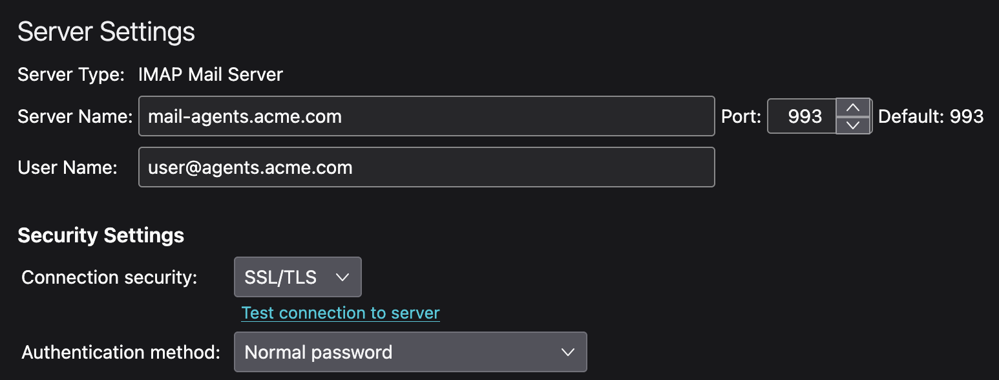
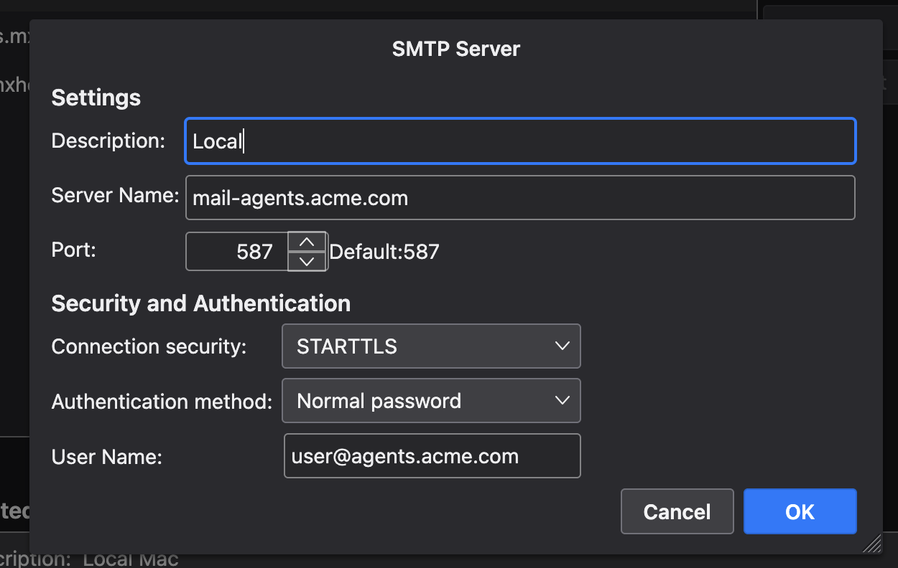

# Observability

So what are my Agent's doing? How are they communicating between each other and with users?

One of the key benefits of the Kikubot framework is that it allows you to easily add observability to your agents via simple email tools. Since every agent uses email, you can follow the activity of your bot in real time simply by checking their inboxes. If you are using the included DMS email services, the following describes a setup we use at mxHERO. In summary, we use the Thunderbird email client to view the inbox of our agents.

* Watch the Inbox to see who is requesting what of an agent.
* Look at the Sent folder to see how the agent responds.
* If we want to re-play a response to an email (maybe after making changes to the agent's configuration), we set the message to unread and the agent will process it again.

## Thunderbird

Although you can use most any email client that supports multiple email accounts like Microsoft Outlook, here we will use the free Thunderbird email client. Thunderbird is available for Windows, macOS, and Linux. You can download Thunderbird from the [Thunderbird website](https://www.thunderbird.net).

#### Thunderbird configured to observe the email traffic between several agents...

### Configuring an email account

The following instructions assume you are using the included DMS email service. If you are using a different email service or email client, you may need to configure differently. For example, if you are using Gmail, you will need to enable IMAP access in your account settings.

Thunderbird supports multiple email accounts. To configure an email account do the following:

### Client configuration screenshots

#### IMAP

* Server: hostname of the IMAP server (e.g., hostname of the DMS server)
* Port: 993 (secure IMAP port)
* Connection Security: SSL/TLS
* Authentication: Normal password

#### SMTP

* Server: hostname of the SMTP server (e.g., hostname of the DMS server)
* Port: 587 (secure SMTP port)
* Connection Security: STARTTLS
* Authentication: Normal password

