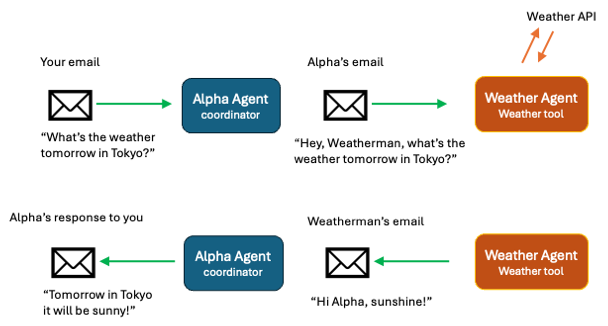
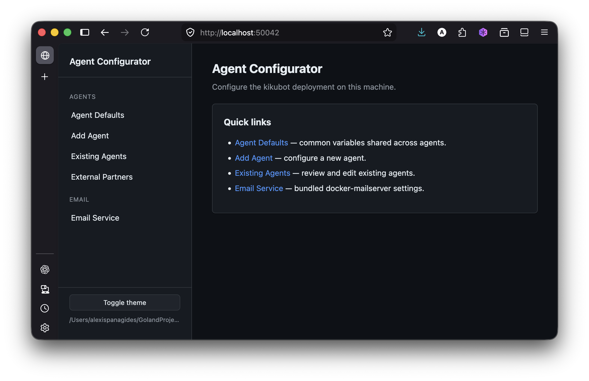

<p align="center">
  <!-- TODO: replace with the project logo -->
  
</p>

<h1 align="center">kikubot</h1>

<p align="center">
  An email-driven, multi-agent framework. Each agent is an inbox.
</p>

---

## Overview

Kikubot turns an email account into an autonomous agent. Each running container polls one IMAP mailbox, runs every new email through an LLM agentic loop with a configurable tool set, and replies via SMTP. Agents collaborate by emailing each other, so a typical deployment looks like several agents — a coordinator and a few specialists — sharing one mail server.

**Why email?** It's the universal asynchronous message bus: humans already use it, every system can send to it, threads carry their own history (`References:` / `In-Reply-To:`), and accounts give you free per-agent identity, ACLs, and durability.

**Benefits:**

- **Email as the AI User Interface.** Deploy AI to an organization via the most used and understood technology - email. No training required, no software to install - just an email address.
- **High Scalability.** Clusters of agents, each agent can be its own cluster - results in theoretically massive scalability.
- **Observability.** Agents communicate with each other via standard email. Access agent accounts to see their internal conversation history.
- **Cost Containment.** Each agent can be configured to a different LLM. Choose the best LLM for the agent's role and toolset.
- **Higher Performance.** Agents can specialize. Capabilities are distributed across the agent network. Each agent focuses on its area of expertise.
- **Greater Security.** No risk of AI agents running on user machines. Kikubot Agents run in containers, providing isolation and security. Agents access tools and integrations via scoped API keys. Access to agents is easily controlled via ACLs (white or blacklist domains, or email addresses).
- **Resilience.** Kikubot networks run over email - one of the most resilient technologies in the world.


**At a glance:**

- **Per-thread memory.** Each email thread is a long-running conversation; the agent's history is persisted as JSON keyed by the thread's root Message-Id.
- **Pluggable tools.** Built-in tools cover messaging, status reporting, snoozing, and mailbox search. Optional tools include Salesforce, WordPress, Buffer, Box, Helpjuice, Tavily web search, Apache Tika file-to-text, and arbitrary local/HTTP MCP servers. Remote HTTP MCP servers are declared in a YAML table (`configs/mcp_servers.yaml`) — adding one is config-only, no Go.
- **Pluggable LLMs.** Anthropic API (default, with prompt caching) or OpenRouter (with backup-model fallback).
- **Knowledge base.** Per-agent and shared markdown files appended to the system prompt — editable live and hot-reloaded without a rebuild.
- **Multi-agent coordination.** Agents talk to each other via the `message_tool` core tool; coordinator agents can delegate, fan out, and snooze pending work.
- **Recurring tasks.** Agents can schedule tasks to run at specific times or intervals.
- **Auto-reply / bounce safety.** DSNs and out-of-office replies bypass the LLM to prevent infinite delegation loops.

### One Agent to Thousands of Agents

You can spawn one or more agent containers with this repository on the same machine. Each container runs a single agent. You can also deploy this repository across multiple machines and spawn agents across your organization. The only requirement is that coordinator agents can reach each other via email.

Coordinator agents can be organized into teams, and each team can have multiple agents. Coordinator agents team members can in themselves be coordinators. Much like how organizations are structured into divisions, with each division representing multiple departments which in turn represent multiple teams – so can you structure your network of agents. Each coordinator only needs to know the subset of agents it works with directly. Theoretically, a Kikubot deployment can scale to hundreds of thousands of agents.

## Live Demo

_Ask Alpha about the weather in your town. Email your query to `alpha@labtest.mxhero.com`_.

<p align="center">
  <!-- TODO: replace with the project logo -->
  
</p>

mxHERO Labs has deployed a Kikubot instance to a single machine. The instance is configured with 2 agents: Alpha and Weatherman. Alpha is the coordinator. If you send an email to Alpha asking about the weather in some city, Alpha will ask the weatherman for the weather forecast. Upon receiving the response, Alpha will send a reply to you.

This small Kikubot demo illustrates how multiple agents can work together over email

## Try it locally (zero-cost)

Want to run your own Kikubot in under a minute, with **no mail account and no API
key required**? The demo spins up a throwaway mail server, a webmail UI, and one
agent — all in Docker, all on your machine, nothing exposed to the internet.

```bash
git clone https://github.com/mxaiorg/kikubot && cd kikubot
./demo.sh
```

Then:

1. Open the webmail UI at **http://localhost:8000**
2. Log in as `human@demo.local` (any password — the demo mail server has auth disabled)
3. Compose a new email to **`kiku@demo.local`** and send it
4. Wait ~30s, refresh the inbox — **Kiku replies.** 🎉

Out of the box (no API key) Kiku replies with a short "I'm alive — add a key for
real answers" notice, so you get the round-trip moment at zero cost. To unlock
real agent responses, drop a key into `configs/demo/secrets.env` and run
`./demo.sh` again — paste either an `ANTHROPIC_API_KEY` or an `OPENROUTER_API_KEY`
and the script auto-selects the matching provider for you (no config editing).
Stop everything with `./demo.sh down`.

Under the hood (`docker-compose-demo.yml`): [GreenMail](https://greenmail-mail-test.github.io/greenmail/)
provides SMTP/IMAP, [Roundcube](https://roundcube.net/) is the compose-window, and
the agent is the same image as production — just pointed at the demo config in
`configs/demo/`.

## References

This project is based on the research of mxHERO Labs. See our [blog post](https://medium.com/datadriveninvestor/the-ai-organization-source-code-included-f2359da8e35e) for more details. 

## Architecture

For a developer-oriented visual map of the runtime, configuration, memory, tools, and integrations, see [docs/architecture.md](docs/architecture.md).

```
   ┌────────────┐       ┌──────────────────┐
   │   Users    │──┐    │    Coordinator   │ ◀──┐
   └────────────┘  │    │   (Kiku inbox)   │    │
                   ▼    └────────┬─────────┘    │
              ┌──────────┐       │              │   email
              │  IMAP /  │       ▼ delegate     │   threads
              │   SMTP   │  ┌─────────┐ ┌─────────┐ ┌─────────┐
              └────┬─────┘  │  Beta   │ │  Gamma  │ │  Delta  │
                   │        │ (CRM)   │ │(social) │ │  (web)  │
                   └────────┴─────────┘ └─────────┘ └─────────┘
                                  │            │           │
                              Salesforce    Buffer    WordPress
                              mxMCP         Tavily    Helpjuice
                                                      Box, Tika
```

Each agent container runs an identical Go binary, parameterised by a shared `configs/agents.yaml` (roster + common defaults + per-agent overrides) and a shared `configs/secrets.env` (API keys + per-agent mailbox passwords). The container picks its identity from the `AGENT_EMAIL` env var injected by docker-compose.

## Prerequisites

- **Docker** (Compose v2).
- **An LLM API key** — `ANTHROPIC_API_KEY` and/or `OPENROUTER_API_KEY`.
- **An IMAP + SMTP server** with one mailbox per agent. You can use any provider; this repo includes a self-hostable docker-mailserver sidecar at `services/dms/` if you want one.
- **(Optional) tool credentials** for any integrations you enable (Salesforce, WordPress, Buffer, Helpjuice, Box, Xero, Tavily, mxMCP).

## Configuration Tool
A dashboard configuration tool can be found in the scripts directory. It's a web app that lets you configure your deployment: define your agents and optionally configure the included email server.

```bash
go run ./scripts/configurator  # serves on 127.0.0.1:50042
```



See [scripts/configurator/README.md](scripts/configurator/README.md) for more details. There is also a, slightly outdated, [Configurator Video Tutorial](https://vimeo.com/1193264234?share=copy&fl=sv&fe=ci)

## AI Configuration
_Use your coding agent_

> ### CONFIGURATION.md
> A configuration guide for LLM guided deployment. To use simply open an LLM coding agent like, Claude Code, and prompt:
> * Read the CONFIGURATION.md file and follow its instructions to help me
    > configure kikubot.
>
> Or if you want to configure in your own language:
> * Read the CONFIGURATION.md file and follow its instructions to help me
    configure kikubot. Communicate with me in Japanese.

### Manual Configuration

```bash
git clone https://github.com/mxaiorg/kikubot
cd kikubot

# 1. Configure the roster + common defaults.
cp configs/agents-example.yaml       configs/agents.yaml
cp configs/mcp_servers-example.yaml  configs/mcp_servers.yaml
cp configs/secrets-example.env       configs/secrets.env
# Edit configs/agents.yaml: keep/edit the common: defaults (mail server,
# prompts, budgets) and the agents: entries (identity, role, tools, optional
# per-agent overrides). configs/mcp_servers.yaml holds the remote-MCP catalog
# (mxmcp, buffer_mcp, tavily_mcp, box_mcp, …); keep the servers you want and
# reference them by key in an agent's tools:. Then edit configs/secrets.env:
# fill in ANTHROPIC_API_KEY (or OPENROUTER_API_KEY) and one
# <UPPERCASED_LOCAL_PART>_EMAIL_PASSWORD per agent, plus any tool credentials.

# 2. (Optional) Drop knowledge files into configs/knowledge/<agent>/*.md

# 3. Edit docker-compose.yml to match your roster.
cp docker-compose-example.yml docker-compose.yml
#    - One service per agent. Each service sets AGENT_EMAIL in `environment:`
#      and points env_file at configs/secrets.env.
#    - Volume mount: ./data/<stem>:/app/data (stem = lowercased local-part).

# 4. Validate.
go run scripts/kikudoctor/*.go

# 5. Launch.
docker compose up -d --build
```

Send the agent an email from a whitelisted address and watch the reply land in your inbox.

To watch the conversation between agents recorded in the logs:

```bash
docker compose logs -f
```

Because Kikubot is an email based system, you can use any email client to follow the internal and external conversation of your agents. See [Observability](README-Observability.md)

## Configuration

### Deployment config — `configs/agents.yaml`

`configs/agents.yaml` is the single source of truth for non-secret deployment config. It has two sections:

```yaml
common:
  email_server: mail.agents.example.com:993
  smtp_server: mail.agents.example.com:587
  email_insecure_tls: false
  max_history_chars: 200000
  max_tokens: 6000
  agent_timeout: 300
  max_turns: 20
  system_prompt: |
    You are a helpful agent...
    {{coworkers}}
  coordinator_system_prompt: |
    You are a helpful Coordenator Agent...
    {{coworkers}}

agents:
  - name: Kiku
    email: kiku@agents.example.com
    role: Coordinator
    description: Communicates with users. Coordinates other agents.
    tools: [report, snooze, tavily_mcp]
    # Any common: field may be overridden here.
    llm_provider: openrouter
    llm_model: anthropic/claude-sonnet-4.6
    max_turns: 40
    whitelist: [example.com, agents.example.com]

  - name: Beta
    email: beta@agents.example.com
    role: CRM, Email Archivist
    description: Manages Salesforce and access to the company email record.
    tools: [mxmcp, salesforce_mcp]
```

The runtime selects its identity from the `AGENT_EMAIL` environment variable (injected per-service in docker-compose). It then merges the `common:` block with that agent's overrides, and JSON-formats every other agent into the `{{coworkers}}` block of the system prompt.

If you deploy Kikubots across multiple machines and want agents to interact between hosts, include those agents in each installation's `agents.yaml`.

Tool keys are defined in [`internal/tools/registry.go`](internal/tools/registry.go) (local tools) and in `configs/mcp_servers.yaml` (remote MCP servers — see below). Whitelist mode is strict (every immediate sender must match). Blacklist mode is lenient (walks the full thread to catch hidden bad actors).

### Remote MCP servers — `configs/mcp_servers.yaml`

Every remote (Streamable-HTTP) MCP server lives in a **declarative table**, kept in its own file so the integration catalog evolves independently of the agent roster. Each row becomes a tool key; an agent opts in by listing that key in its `tools:`. **Adding a remote MCP is config-only — no Go.** (Local stdio MCP servers — `salesforce_mcp`, `box_cli`, `xero_mcp` — are still wired in `registry.go`; this table is for remote HTTP servers.)

```yaml
mcp_servers:
  # Static "Authorization: ApiKey <token>" header.
  - key: mxmcp
    url: https://lab4-mcp.mxhero.com/mcp2/connect
    auth: apikey
    token_env: MXMCP_API_KEY
    description: "mxHERO email search across an organization's archived accounts."

  # Static "Authorization: Bearer <token>" header.
  - key: tavily_mcp
    url: https://mcp.tavily.com/mcp
    auth: bearer
    token_env: TAVILY_API_KEY
    description: "Tavily web search."

  # OAuth2 with automatic token refresh.
  - key: box_mcp
    url: https://mcp.box.com
    auth: oauth2
    client_id_env: BOX_CLIENT_ID
    client_secret_env: BOX_CLIENT_SECRET
    description: "Box content management (official Box MCP server)."
```

**Auth modes:**

| `auth` | Header sent | Required fields |
|---|---|---|
| `none` | _(none)_ | — |
| `bearer` | `Authorization: Bearer <token>` | `token_env` |
| `apikey` | `Authorization: ApiKey <token>` (default) | `token_env` |
| `oauth2` | bearer access token, auto-refreshed | `client_id_env`, `client_secret_env` |

- For `apikey`, set `header:` (e.g. `X-Api-Key`) to put the raw token in a separate header instead of `Authorization`, or `scheme:` to override the `ApiKey` prefix.
- For `oauth2`, kikubot delegates refresh to the [mcp-go](https://github.com/mark3labs/mcp-go) OAuth handler. Hand-seed the access+refresh pair **once** into `oauth/<key>.json` (dev) or `data/oauth/<key>.json` (container, persisted volume) — a serialised `transport.Token`. kikubot rotates and rewrites it on every refresh, so the single-use refresh token survives restarts. Set `metadata_url:` to pin the OAuth server-metadata endpoint if discovery from `url` fails. Optionally set `expires_at` in the past to force a refresh on the first call.

A misconfigured row (unknown `auth`, missing required field) is logged and skipped — it can't take the agent down. A valid row whose credentials are simply unset registers fine but yields no tools. Resolution order for the file: `MCP_SERVERS_CONFIG` env var → next to the binary → next to the source. A missing file just means no remote MCPs (not an error). See [`configs/mcp_servers-example.yaml`](configs/mcp_servers-example.yaml).

### Secrets — `configs/secrets.env`

Every container loads `configs/secrets.env` as a docker-compose `env_file`. Conventions:

| Variable | Purpose |
|---|---|
| `ANTHROPIC_API_KEY` / `OPENROUTER_API_KEY` | LLM credentials (at least one required). |
| `<UPPER_STEM>_EMAIL_PASSWORD` | Mailbox password, one per agent. Stem = uppercased local-part of the agent email. Example: `KIKU_EMAIL_PASSWORD` for `kiku@…`. |
| Tool credentials | `SALESFORCE_CLIENT_ID`, `BUFFER_API_KEY`, `WORDPRESS_PASSWORD`, … (see `configs/secrets-example.env`). |

The container resolves its own mailbox password by uppercasing the local-part of `AGENT_EMAIL` and appending `_EMAIL_PASSWORD` — no per-agent env file needed.

### Knowledge base — `configs/knowledge/`

Markdown files appended to each agent's system prompt. They're the simplest way to give an agent durable, always-in-context knowledge — company facts, tone of voice, naming conventions, links — without touching code or the system prompt itself. Each agent loads the shared `common/` directory plus its own `<local-part>/` directory (matching the email local-part, so `kiku@…` reads `configs/knowledge/kiku/`).

```
configs/knowledge/
├── common/         # loaded by every agent
│   ├── 01_company.md
│   └── 02_voice.md
└── kiku/           # loaded only by kiku@…  (matches the email local-part)
    └── 01_file_links.md
```

Files are sorted by name — use numeric prefixes (`01_`, `02_`) to control ordering. The `common/` files come first, then the agent's own. Because knowledge lives in the cacheable prefix of the system prompt, large knowledge bases don't re-cost tokens on every email (with the Anthropic provider).

**Live editing — no rebuild required.** The knowledge directory is bind-mounted into each container (`./configs/knowledge:/app/knowledge:ro` in `docker-compose.yml`), so edits on the host are immediately visible inside the container. Agents hot-reload them: each poll cycle re-reads the files if any changed, so an edit takes effect within ~30s — no image rebuild, no container restart. For instant propagation, send `SIGHUP`:

```bash
docker compose kill -s HUP kiku    # reload one agent now
```

The [`scripts/configurator`](scripts/configurator/README.md) dashboard edits these files for you and fires that signal automatically after a save or delete (falling back to the poll if the signal can't be delivered). See [`configs/knowledge/readme.md`](configs/knowledge/readme.md).

### Tool credentials

Each integration adds its own variables to `configs/secrets.env`. The most common:

- **`salesforce_mcp`** — `SALESFORCE_CLIENT_ID`, `SALESFORCE_CLIENT_SECRET`, `SALESFORCE_INSTANCE_URL`
- **`wordpress`** — `WEBSITE_URL`, `WORDPRESS_USER`, `WORDPRESS_PASSWORD`
- **`buffer_mcp`** — `BUFFER_API_KEY`
- **`helpjuice`** — `HELPJUICE_API_KEY`, `HELPJUICE_ACCOUNT`
- **`xero_mcp`** — `XERO_CLIENT_ID`, `XERO_CLIENT_SECRET`
- **`tavily_mcp`** — `TAVILY_API_KEY`
- **`mxmcp`** — `MXMCP_API_KEY`
- **`box_mcp`** (remote Box MCP, OAuth2) — `BOX_CLIENT_ID`, `BOX_CLIENT_SECRET`, plus a hand-seeded token file at `data/oauth/box_mcp.json` (see [Remote MCP servers](#remote-mcp-servers--configsmcp_serversyaml))
- **`box_cli`** (local Box CLI) — drop a Box JWT app config at `box_config.json` (the Dockerfile registers it during the image build)
- **`file_text`** — `TIKA_URL` (defaults to the bundled Tika sidecar)

  Note: `buffer_mcp`, `tavily_mcp`, `mxmcp`, and `box_mcp` are **remote MCP servers** declared in `configs/mcp_servers.yaml`; only their secrets live here.

## Tools

A **tool** is anything the agent can call mid-conversation. Each tool is a `ToolDefinition` with a name, JSON-schema input, an `Execute` function, and (optionally) text contributed to the system prompt.

### Built-in catalogue

**Core tools** — always loaded for every agent ([`internal/tools/core.go`](internal/tools/core.go)):

| Tool | Purpose |
|---|---|
| `message_tool` | Send email to a coworker — the primitive for multi-agent coordination. |
| `set_task_status` | Mark the current task waiting / complete / error so the memory file reflects state. |
| `mbox_search` | Search the agent's own IMAP mailbox by sender, subject, date, or full-text. |

**Optional tools** — opt-in per agent via the `tools:` list in `agents.yaml` ([`internal/tools/registry.go`](internal/tools/registry.go)):

| Key                    | What it does                                                                                          |
|------------------------|-------------------------------------------------------------------------------------------------------|
| `report`               | Send a structured reply to the user (used by coordinators).                                           |
| `report_strict`        | Send a structured reply to the sender only (used by coordinators). Good for public facing agents.     |
| `snooze` / `unsnooze`  | Schedule or cancel a recurring/one-off replay of the current message — see **Recurring tasks** below. |
| `anthropic_web_search` | Anthropic's server-side web search tool. Only works with Anthropic LLMs.                              |
| `tavily_mcp`           | Tavily web search via MCP.                                                                            |
| `salesforce_mcp`       | Salesforce CRM via the `@tsmztech/mcp-server-salesforce` MCP server.                                  |
| `buffer_mcp`           | Schedule social posts via Buffer's MCP.                                                               |
| `xero_mcp`             | Xero accounting via MCP.                                                                              |
| `xero_api`             | Xero accounting via API.                                                                              |
| `mxmcp`                | mxHERO email-search MCP.                                                                              |
| `wordpress`            | Read/write posts on a WordPress site.                                                                 |
| `helpjuice`            | Read/write FAQ articles in Helpjuice.                                                                 |
| `box_cli`              | File operations against Box via the local Box CLI (download/attach, read-text, shared links).         |
| `box_mcp`              | Box content management via the official remote Box MCP server (OAuth2).                                |
| `download`             | Fetch a URL to disk.                                                                                  |
| `file_text`            | Convert any file to plain text via Apache Tika.                                                       |
| `bash`                 | Execute arbitrary bash locally — full network access.                                                 |
| `vimeo`                | Simplified read-only access to Vimeo library.                                                         |
| `nuki`                 | Manage Nuki device accounts and keypad codes.                                                         |
| `supabase`             | Supabase/PostgREST CRUD.                                                                              |
| `weather`              | Weather API                                                                                           |

> The remote-MCP keys above (`tavily_mcp`, `buffer_mcp`, `mxmcp`, `box_mcp`) are **not** in `registry.go` — they're rows in [`configs/mcp_servers.yaml`](configs/mcp_servers.yaml) registered at startup (see [Remote MCP servers](#remote-mcp-servers--configsmcp_serversyaml)). The rest are local tools from `registry.go`. Either kind is enabled the same way: list its key in an agent's `tools:`.

### Private tools

Not every tool belongs in the public repo — company-specific integrations, proprietary logic, or anything you simply don't want to publish. These live in [`internal/tools_priv/`](internal/tools_priv/) and work exactly like built-in tools: drop a `.go` file there, register it from an `init()` with `tools.Register(key, factory, description)`, add the key to an agent's `tools:` list, and it's available. `cmd/kikubot` blank-imports the package unconditionally, so any files present are compiled and registered automatically; when the directory is empty (a clean public checkout), it contributes nothing.

**Why it matters: update without conflicts.** The public distribution ships this directory effectively empty, so your private tool files sit *outside* the upstream-tracked code. You can keep pulling project updates and never hit a merge conflict over your own tools. (Their secrets follow the same idea — private tools read credentials directly via `os.Getenv` rather than declaring them in the public `internal/config/env_vars.go`, so no symbol referencing them appears in the public repo.) The configurator dashboard flags any private tool with a small **private** badge so it's clear which tools depend on local-only source.

See the [tools README](internal/tools/README.md) for the full convention and a worked example.

### Writing your own tool

> 🤖 We are successfully adding tools via Claude Code. Claude will review existing tools and build yours including adding it to the registry, etc. Your tool can be an MCP, a CLI, a web API, etc. - Claude builds them all. Typically it takes less than 10 minutes to build a tool in this manner.

Every tool is a `ToolDefinition` value. The minimum:

```go
// internal/tools/weather.go
package tools

import (
    "context"
    "encoding/json"
    "fmt"
)

func WeatherTool() ToolDefinition {
    return ToolDefinition{
        Name:        "weather_lookup",
        Description: "Look up the current temperature for a city.",
        InputSchema: []byte(`{
            "type": "object",
            "properties": {
                "city": {"type": "string", "description": "City name"}
            },
            "required": ["city"]
        }`),
        // StaticSystem is appended to the cacheable prefix of the system
        // prompt — use it for instructions that don't depend on the email.
        StaticSystem: "Use weather_lookup when the user asks about the weather.",
        Execute: func(ctx context.Context, input json.RawMessage) (string, error) {
            var args struct{ City string `json:"city"` }
            if err := json.Unmarshal(input, &args); err != nil {
                return "", err
            }
            // ... call your API ...
            return fmt.Sprintf("22°C in %s", args.City), nil
        },
    }
}
```

Then register it under a YAML key in [`internal/tools/registry.go`](internal/tools/registry.go):

```go
var registry = map[string]toolFactory{
    // ...
    "weather": wrap(WeatherTool),
}
```

…and add `weather` to the `tools:` list of any agent in `configs/agents.yaml`.

#### Environment variables for API keys
If an API key is passed in via environment variables, be sure to update `internal/config/env_vars.go` and include the exported variable (`config.YouEnvVar`) in your tool code. Then of course, add the env var to the `env/` files.

#### Injecting email context into the tool system prompt
For per-email context (e.g. injecting the current date, or summarising thread state), set the `System func(email services.Email) (string, error)` field instead of `StaticSystem` — its output goes into the *volatile* portion of the system prompt and is not cached.

### Helpers for common patterns

Most integrations don't need a hand-written `Execute`. The `tools` package provides three reusable bridges:

- **Shell commands** → [`BashTool()`](internal/tools/bash.go). Already registered as the `bash` key. Runs locally with full network access (unlike Anthropic's sandboxed `bash_code_execution`). Use this rather than rolling your own `os/exec` wrapper.

- **Local MCP servers (stdio)** → [`LocalMCPBridge(LocalMCPConfig)`](internal/tools/mcp_helper.go) launches an MCP server as a long-lived subprocess (e.g. an `npx`-installed package), discovers its tools, and exposes each one as a `ToolDefinition` named `<server>__<tool>`. Example from [`salesforce_mcp.go`](internal/tools/salesforce_mcp.go):

  ```go
  func SalesforceMCP() []ToolDefinition {
      cfg := LocalMCPConfig{
          ServerName: "salesforce",
          Command:    "npx",
          Args:       []string{"-y", "@tsmztech/mcp-server-salesforce"},
          Env: map[string]string{
              "SALESFORCE_CLIENT_ID":     os.Getenv("SALESFORCE_CLIENT_ID"),
              "SALESFORCE_CLIENT_SECRET": os.Getenv("SALESFORCE_CLIENT_SECRET"),
          },
      }
      tools, _ := LocalMCPBridge(cfg)
      return tools
  }
  ```

  If the MCP server ships as an npm package, also pre-install it in the Dockerfile so `npx` doesn't fetch it on first call.

- **Remote MCP servers (HTTP)** → **don't write Go for these.** Add a row to [`configs/mcp_servers.yaml`](configs/mcp_servers.yaml) (see [Remote MCP servers](#remote-mcp-servers--configsmcp_serversyaml) above) and reference its `key` from an agent's `tools:`. `RegisterMCPServers` turns each row into a registry factory at startup using the shared `MCPBridge` / `MCPBridgeHeaders` / `MCPBridgeOAuth` plumbing in [`mcp_helper.go`](internal/tools/mcp_helper.go), so there are no per-server `TavilyMCP()` / `BoxMCP()` factories to maintain. Static-bearer, ApiKey, and OAuth2 (with auto-refresh) are all covered declaratively. Reach for `MCPBridge*` directly in Go only if you need behaviour the table can't express.

- **Hand-curated CLI wrappers** → [`CLIToolConfig`](internal/tools/cli_helper.go) is the same idea as `LocalMCPBridge` but for CLIs that don't speak MCP — you author the schemas yourself and the helper handles subprocess execution, JSON-flag injection, and root-path scoping.

### More about tools

Read more about tools in the [tools README](internal/tools/README.md)

## Recurring tasks

Agents can schedule themselves. The `snooze` / `unsnooze` tools (registered via the `snooze` and `unsnooze` keys in `agents.yaml`) let an agent park the current email and replay it on a cron schedule.

**How it works:**

1. The agent calls `snooze_tool` with the inbound `Message-Id`, a description, a `Once` flag, and a 5-field crontab expression (`minute hour dom month dow`).
2. The schedule is persisted to `data/snooze.json` (or `snooze.json` in dev) — one entry per snoozed message.
3. Every poll cycle (30s), the main loop drains all snoozes whose next-run time has passed. For each, it re-fetches the original email by Message-Id, prepends a system note ("This email is being replayed as a previously scheduled task — do NOT snooze again"), and runs `agent.HandleMessage`. The `snooze_tool` and `unsnooze_tool` are stripped from the toolset for that replay so the model can't re-schedule itself into a loop.
4. After successful execution: `Once: true` snoozes are deleted; recurring snoozes advance to the next cron-computed run time.
5. To cancel, the agent calls `unsnooze_tool` with the Message-Id. The system prompt also surfaces any active snoozes for the current thread so a follow-up "stop the daily report" maps to the right cancellation.

**Timezone handling.** The crontab is interpreted in the *user's* timezone, extracted from the original email's `Date:` header. So `0 7 * * *` means 7 AM in the sender's local time even if the server runs in UTC. Both IANA names (`America/New_York`) and fixed offsets (`-0500`) are supported.

**Example user prompts that trigger snoozing:**

- *"Send me the social-media metrics every Monday at 9am."* → `0 9 * * 1`, `Once: false`
- *"Remind me about the contract review tomorrow at 2pm."* → one-off with `Once: true`
- *"Stop the daily standup digest."* → triggers `unsnooze_tool` against the matching active snooze

The scheduler is single-process and file-backed — no external dependencies. If you run an agent across multiple replicas, only one should own the snooze file (mount it on a single volume or run a single instance per inbox).

## Auxiliary services

Both are optional sidecars with their own compose files.

### Mail server — `services/dms/`

A docker-mailserver instance for hosting agent inboxes on a domain you control (SPF/DKIM/DMARC strongly recommended). See [`services/dms/README.md`](services/dms/README.md) for account-management commands.

### Apache Tika — `services/tika/`

REST API for extracting text from PDFs, Office docs, HTML, and more. Used by the `file_text` tool. See [`services/tika/README.md`](services/tika/README.md).

## Running multiple agents

`docker-compose-example.yml` ships with one active service (`kiku`) and commented templates for `beta`, `gamma`, and `delta`. To bring up additional agents, uncomment the service block and ensure a matching entry exists in `configs/agents.yaml` and a matching `<UPPER_STEM>_EMAIL_PASSWORD` in `configs/secrets.env`. The `scripts/configurator` tool can regenerate `docker-compose.yml` for you whenever you add or edit an agent.

```bash
# After editing docker-compose.yml + adding agents/secrets:
docker compose up -d --build --remove-orphans

# After only secrets.env changes:
docker compose up --force-recreate
```

## Development

Local development uses Go 1.26 and the `dev` build tag, which loads `./configs/secrets.env` via godotenv. Non-secret config (the agent roster, common defaults, per-agent overrides) is read from `./configs/agents.yaml`. Set `AGENT_EMAIL` in your shell or IDE run-configuration to pick which agent the binary impersonates.

```bash
go run -tags=dev cmd/kikubot/main.go
```

Architectural notes for code changes live in [`CLAUDE.md`](CLAUDE.md).


## About

> **About this repo.** Kikubot is developed primarily for our own production use at mxHERO and released here under MIT so the community can build on it. We're a small team, so issue and PR turnaround varies — but we read everything, and we welcome contributions. See CONTRIBUTING.md for how we evaluate changes and where we most need help..

> **Status.** This project is in active development. Compatibility with microsoft based emails (e.g., Office 365) is not yet fully tested.


## Naming

We named our framework, Kikubot, from the Japanese contraction for Kiku (機駆) - 機 (ki, "mechanism") + 駆 (ku, "to drive/propel"). A machine that moves.

## License

[MIT](LICENSE) — © [mxHERO](https://mxhero.com) Inc.
