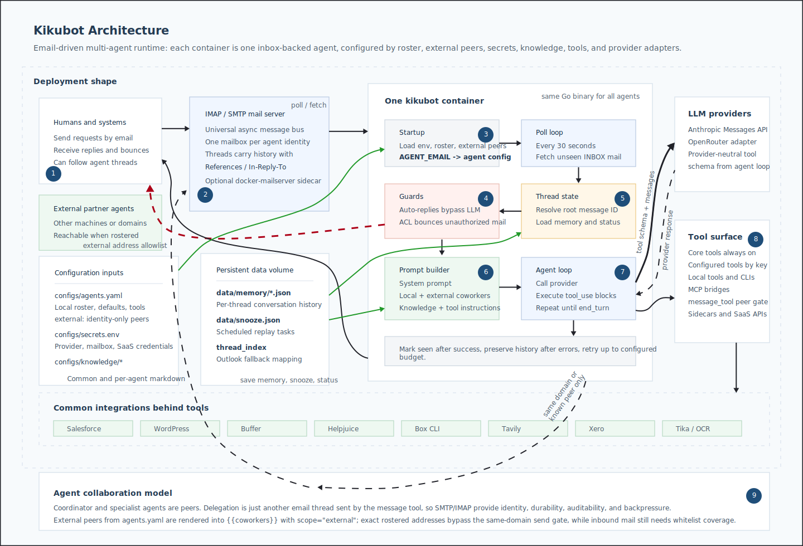

# Kikubot Architecture Infographic

## Runtime Flow

1. `docker compose` starts one identical `kikubot` container per agent.
2. `AGENT_EMAIL` selects the matching roster entry from `configs/agents.yaml`.
3. The process polls IMAP every 30 seconds for unseen mail in that agent inbox.
4. Guard rails run before the LLM: auto-replies bypass the agent loop, and ACLs can bounce unauthorized senders.
5. The thread root is resolved from `References`, `In-Reply-To`, or Outlook `Thread-Index`, then persisted memory is loaded.
6. The agent builds its prompt from the roster, coworker list, mounted knowledge files, and enabled tool instructions.
7. The provider adapter calls Anthropic or OpenRouter with provider-neutral tool definitions.
8. Tool calls execute locally, through MCP bridges, or against sidecar services and SaaS APIs.
9. Replies, bounces, and coworker delegations are sent through SMTP. Conversation history, statuses, thread indexes, and snoozes are written under the agent data volume.

## Code Map

| Area | Main files |
| --- | --- |
| Process loop | `cmd/kikubot/main.go` |
| Agent loop | `internal/agents/agent.go` |
| Configuration | `internal/config/config.go`, `configs/agents-example.yaml`, `configs/secrets-example.env` |
| Mail and attachments | `internal/services/emailing.go` |
| Memory and thread state | `internal/services/memory.go`, `internal/services/thread_index.go`, `internal/services/snooze.go` |
| LLM adapters | `internal/provider/anthropic.go`, `internal/provider/openrouter.go` |
| Tool registry | `internal/tools/registry.go` |
| Deployment examples | `docker-compose-example.yml`, `services/*/docker-compose*.yml` |

