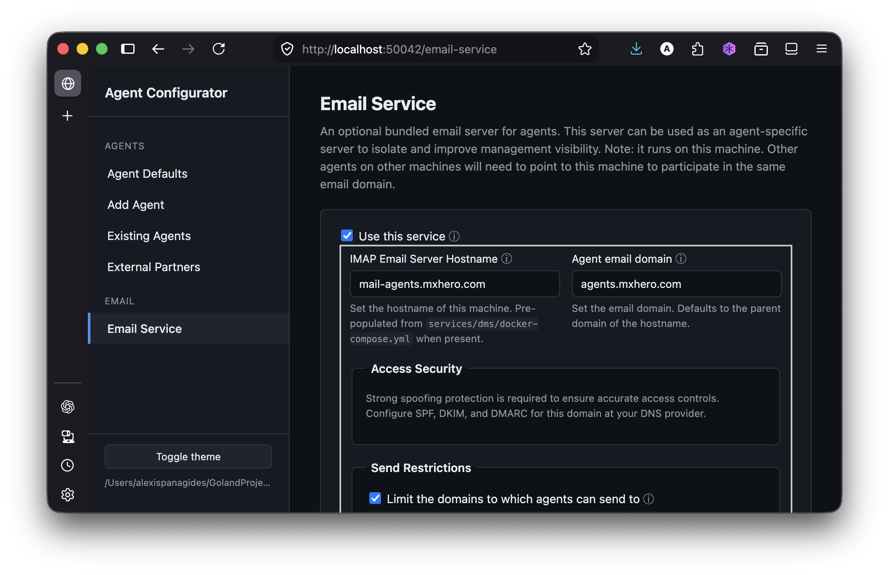

# Agent IMAP/SMTP Server

A mail server for agent communication. This server is provided as an option for agents to use. Agents can use any email server provided that they can connect to it via IMAP and SMTP.

As an extra security precaution, it is recommended to use a dedicated email domain for agent communication. The example configuration provided here ensures that no email is received or delivered outside the company and agent email domains.

If you do use this server, be sure to properly configure the email domain for delivery (SPF, DKIM, DMARC suggested). See [README-SPF_DKIM_etc.md](README-SPF_DKIM_etc.md)

See the config directory for additional domain configuration.

## Why create a separate agent domain?

By isolating agent traffic to its own domain, it is easier to control inbound and outbound traffic of the agents. Furthermore, you can more easily observe and control agent activity by configuring an IMAP client with multiple agent accounts. For example, with the [Thunderbird](https://www.thunderbird.net/) client.

More about observation and control of agent activity see this [README](../../README-Observability.md)

## Configurator Installation

Go to the 'Email Service' page in the [Configurator](../../scripts/configurator/README.md) to configure the email domain.



## Manual Installation

### Docker

```bash
cp docker-compose.yml.example docker-compose.yml
```

Edit the `docker-compose.yml` file to configure the email domain:

```dockerfile
#   Change the hostname and domainname to match your case
    hostname: mail.agents.example.com
    domainname: agents.example.com
```

```
docker compose up -d
```

## Testing

Once you have the server running, you can test it by connecting to it with an IMAP client. One easy way is to create a generic user account in the server and use the Thunderbird client to connect to it.

From below, add your user to the server:

```bash
docker exec -it dms bash
# Create accounts (create your own email addresses and passwords)
root@mele:/# setup email add user@agents.mxhero.com "pass"
```

When configuring your Thunderbird client, see details in [README-Observability.md](../../README-Observability.md#configuring-an-email-account)

### Managing Agent Email Accounts

If you're using the **Configurator** (`scripts/configurator`), account
management is automatic: every time you save the Email Service page or
add/edit an agent, the Configurator regenerates `config/postfix-accounts.cf`
from the roster and the per-agent passwords in `configs/secrets.env`. New
agents get fresh SHA-512 crypt hashes; agents removed from the roster are
dropped from the file. Restart the dms container to pick up changes.

For manual management, connect to the container and run:

```bash
# Connect to the container
docker exec -it dms bash

# Create accounts (create your own email addresses and passwords)
root@mele:/# setup email add kiku@agents.mxhero.com "pass"
root@mele:/# setup email add beta@agents.mxhero.com "pass"
root@mele:/# setup email add gamma@agents.mxhero.com "pass"
root@mele:/# setup email add delta@agents.mxhero.com "pass"

# Delete accounts
root@mele:/# setup email del alpha@example.com

# Updating accounts
root@mele:/# setup email update alpha@agents.mxhero.com "newpass"

# List accounts
root@mele:/# setup email list

# Recreating
docker rm -f dms && docker compose up --force-recreate
```

```bash
# TESTING
openssl s_client -connect mail.agents.example.com:993 -quiet
```

### Using Self signed certificates

To manually generate a self signed certificate,

```bash
cd services/dms
mkdir -p ./certs
# Replace the CN and subjectAltName with your own
# In the example below, 'mail.agents.example.com' is the hostname 
# and 'agents.example.com' is the domain name.
openssl req -x509 -newkey rsa:4096 -sha256 -days 3650 -nodes \
  -keyout ./certs/privkey.pem \
  -out   ./certs/fullchain.pem \
  -subj  "/CN=mail.agents.example.com" \
  -addext "subjectAltName=DNS:mail.agents.example.com,DNS:agents.example.com"
```
⚠️ Set the environment variable `email_insecure_tls: true` in `common` section of  `configs/agents.yaml`

## Log analysis

```bash
docker exec -it dms cat /var/log/mail/mail.log > /tmp/log.txt
# look for errors
grep postfix/error /tmp/log.txt 
```