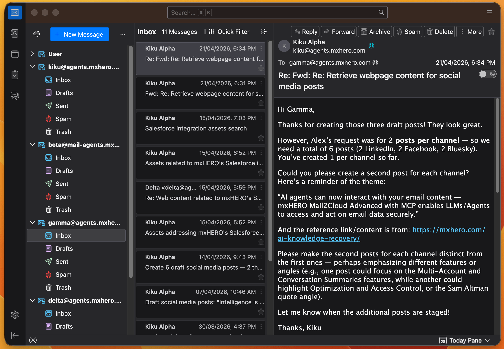

# DMS (Docker Mailserver) Config

In the example configuration files, agents are in the `agents.example.com` domain and are only able to receive from and send to the domain `example.com` and `agents.example.com`.

Copy the example configuration files in the config directory, removing '-example'.
```bash
cp postfix-sender-access-example.cf postfix-sender-access.cf
cp postfix-transport-example.cf postfix-transport.cf
```

Replace the `example.com` with your own domain name. Replace the `agents.example.com` with your own agents' subdomain.

You could, of course, use the same domain for both, but having a specific domain for the agents allows for easier isolation and inspection of agent activity.

## Why create a separate agent domain?

By isolating agent traffic to its own domain, it is easier to control inbound and outbound traffic of the agents. Furthermore, you can more easily observe and control agent activity by configuring an IMAP client with multiple agent accounts. For example, with the [Thunderbird](https://www.thunderbird.net/) client.

